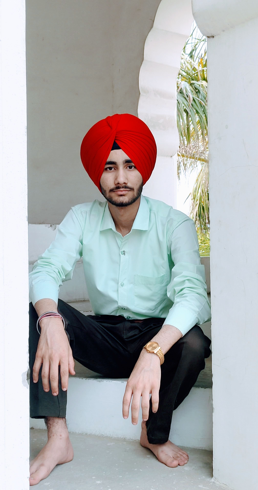

# Induction Program Report – GNDEC 2025

This repository contains my report for the Induction Program held at Guru Nanak Dev Engineering College in July–August 2025. 

## Student Information
- **Name:** Charanpreet Singh  
- **Branch:** Electrical Engineering  
- **Registration Number:** 25101199  
- **Mobile:** 9781745532  
- **Email:** charanpreetsingh856@gmail.com

## Day 1 (30 July 2025 – Electrical Engineering)

I was eagerly waiting for today — it was my first day in college (GNDEC). The day started with a welcome talk by our respected Principal Sir. He told us about the role of discipline, passion, and enthusiasm in shaping a better future. I was surprised to learn that the college was established in 1956 and is now celebrating its 70th anniversary. 

The guest speaker said that engineering is fascinating and not just about machines and code, but about solving real-world problems with creativity and courage. I also met a few classmates, whom I didn't know in the morning, but by the end of the session, I had already started bonding with them. 

I think the college is doing its very best to provide us with great facilities and soft-spoken, supportive mentors. It gave me great joy and pride to be part of this institution. I am excited to begin my studies in such a fantastic environment. If the college is giving its best to support us, then we should also give our best to become responsible students and good citizens. This will help us raise our standard of living.

---

## Day 2 (01 August 2025)

On the second day of joining the program at GNDEC, we had a wonderful session on **Universal Human Values (UHV)** by Dr. Priya Darshini Madam. She spoke about living with intention, knowing our identity, and building healthy relationships.

Following that, we had an interactive session with Dr. Arvind Dhingra Sir on **personality development** and transitioning into confident and responsible individuals. He also made the session fun by including us in interactive games and activities that taught us the value of teamwork, communication, and self-awareness.

Overall, it was an enjoyable and motivating day that helped us learn while having fun.

---

## Day 3 (03 August 2025)

The third day of the Induction Program at GNDEC was both engaging and educational. We began our day with a session on **Universal Human Values (UHV)**, where we explored reflections on clarity of thoughts, inner harmony, and responsibility. Dr. Priya Darshini Madam emphasized the importance of aligning our goals with purpose and how being a good human being is the foundation of being a good engineer.

After UHV, we attended our **C++ programming class**, where we were introduced to input/output statements using `cin` and `cout`. We practiced writing a basic program to display our name using `cout`, which helped us understand the structure of a C++ program. The session sparked our interest in programming and logic building.

Later in the day, we had our **Physics class**, where we discussed core concepts related to motion and measurement. The teacher explained how these fundamentals apply to real-world engineering. It made the subject more meaningful and showed how Physics is essential for all branches of engineering.

Overall, Day 3 was a great blend of moral understanding and technical education. I found it both enlightening and motivating.

---

##  Day 4 (03 August 2025)

The third day of the Induction Program at GNDEC was both engaging and educational. We began our day with a session on **Universal Human Values (UHV)**, where we explored deeper reflections on clarity of thoughts, inner harmony, and our responsibility towards others. Dr. Priya Darshini Madam emphasized the importance of aligning our goals with a sense of purpose and how being a good human being forms the foundation of being a good engineer. Her words were thoughtful and inspiring, reminding us that values and emotions play a key role in our academic and personal growth.

Following the UHV session, we moved on to our **C++ programming class**, where we were introduced to the concept of input and output statements in C++. The faculty demonstrated how to use `cin` and `cout` to take input from the user and display output on the screen. We also practiced writing a small program to display our name using `cout`, which helped us understand the syntax structure of the language. The class gave us a glimpse into the logic-building and problem-solving skills we’ll need throughout our engineering journey.

Later in the day, we attended our **Physics class**, where the teacher explained core concepts related to motion, measurements, and physical quantities. What stood out the most was how the teacher connected theoretical concepts with practical, real-life engineering applications. It made the subject more meaningful and relatable. We also discussed how physics forms the base of all engineering branches, including electrical, mechanical, and civil engineering.

Overall, Day 3 was filled with valuable insights from both moral and technical perspectives. The day struck a great balance between personality development and academic learning. I felt more connected to the subjects, and I’m looking forward to learning more in the coming sessions.

---

## Day 5 (05 August 2025)

Today at GNDEC, we gathered in the auditorium for an informative and engaging session on **Millets – The Super Food**. The speaker explained how millets are not only rich in nutrients like fiber, iron, and calcium but also environmentally friendly due to their low water requirements. We learned about their role in maintaining health, supporting sustainable agriculture, and why they are being promoted globally as a smart food choice. It was eye-opening to see how traditional grains can contribute to modern health and wellness.

---

##  Remarks About the Induction Program

The welcome at GNDEC and the Induction Program as a whole were extremely valuable. It gave me a taste of college life and helped me understand how to take advantage of everything the campus has to offer. I learned about the college's vision, its achievements, and the support system available to students.

The sessions made me feel more comfortable, motivated, and connected to both the faculty and my classmates. In short, the program covered everything needed to give me a positive and encouraging start to my engineering journey. I feel grateful to be a part of this experience — it’s the best a student could hope for.

---

## Conclusion

The Induction Program at GNDEC provided a strong foundation for the journey ahead. It helped me understand the values, expectations, and support systems of the institution while also allowing me to connect with my peers and faculty members. Through interactive sessions, value-based learning, and personality-building activities, I gained both clarity and motivation. 

I now feel more confident, responsible, and inspired to give my best in academics and personal growth. I am proud to be a part of GNDEC and truly look forward to the experiences and learning that lie ahead

